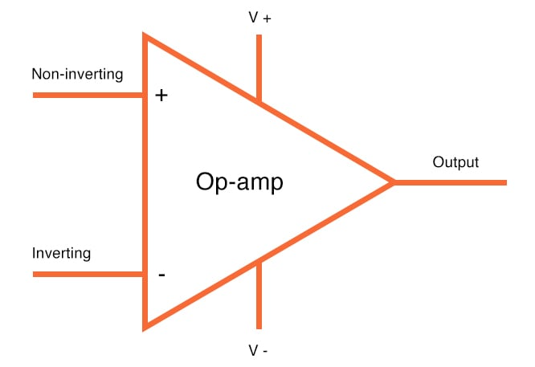
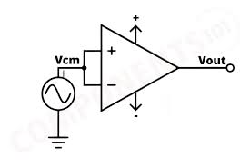
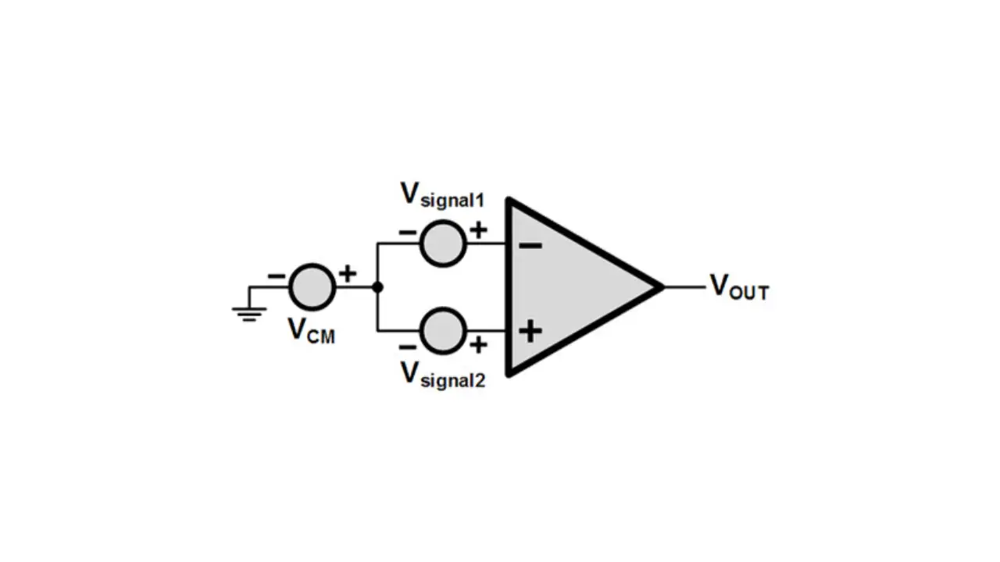
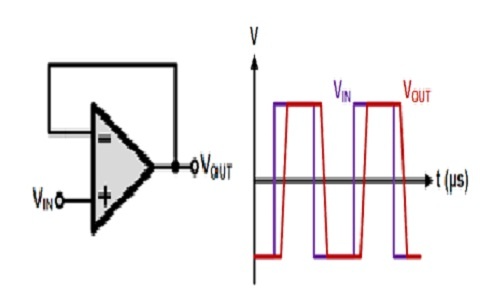

An Operational Amplifier, or op-amp for short, is fundamentally a voltage amplifying device designed to be used with external feedback components such as resistors and capacitors between its output and input terminals. These feedback components determine the resulting function or “operation” of the amplifier and by virtue of the different feedback configurations whether resistive, capacitive or both, the amplifier can perform a variety of different operations, giving rise to its name of “Operational Amplifier”.  
An Operational Amplifier is basically a three-terminal device which consists of two high impedance inputs. One of the inputs is called the Inverting Input, marked with a negative or “minus” sign, ( – ). The other input is called the Non-inverting Input, marked with a positive or “plus” sign ( + ).  
A third terminal represents the operational amplifier's output port which can both sink and source either a voltage or a current. In a linear operational amplifier, the output signal is the amplification factor, known as the amplifier's gain ( A ) multiplied by the value of the input signal. 

 

Fig.1 Operational Amplifier
 

<h3>Common Mode Gain</h3>
Common-mode voltage gain refers to the amplification given to signals that appear on both inputs relative to the common (typically ground). … This means the output is unaffected by voltages that are common to both inputs.   
Voltage applied to both input is common, it is referred as common mode voltage Vcm. The common mode voltage Vcm can be DC, AC and a combination of AC and DC.  

 

Fig.2 Common Mode Gain circuit
 

 Vcm = (V1 + V2)/2 
 
Vocm = Acm &times; Vcm 
Acm = Vocm / Vcm 

 
<h3>Differential Mode Gain</h3>
Instead of applying superposition theorem with V1 and V2 separately, a better way is to first combine V1 and V2 in a different format, viz. (V1 - V2). This is known as the differential mode input - Vd.   
Differential mode component: Vd = (V1 - V2)  
Gain = VOUT / (V1 - V2)  
Gain = VOUT / Vd    

This gain is known as the Differential Gain (Ad) as it is based on the differential input alone. 

<h3>The common-mode rejection ratio (CMRR)</h3>
The common-mode rejection ratio (CMRR) is defined as the ratio of differential voltage gain Ad to the common-mode voltage gain ACM. 
i.e. CMRR = Ad / ACM 

 

Fig.3 The common-mode rejection ratio circuit
 

<h3>Slew Rate</h3>
Slew rate is defined as the maximum rate of change of output voltage caused by a step input voltage and is expressed in volts per microseconds.   

 

Fig.4 Slew Rate Op-Amp circuit
 

Vs = VmSin ωt  
Vo = Vm Sin ωt 
dVo / dt = Vm ω Cos ωt 
SR  =  dVo/dt |max V/µs  

But, Slew rate:  

Put max value of Cos ωt in the equation:  
SR = Vm ω (ω = 2πf)  
SR = Vm 2πf V/sec  
Slew rate indicates how rapidly the output of an op-amp can change in response to changes in the input frequency.
